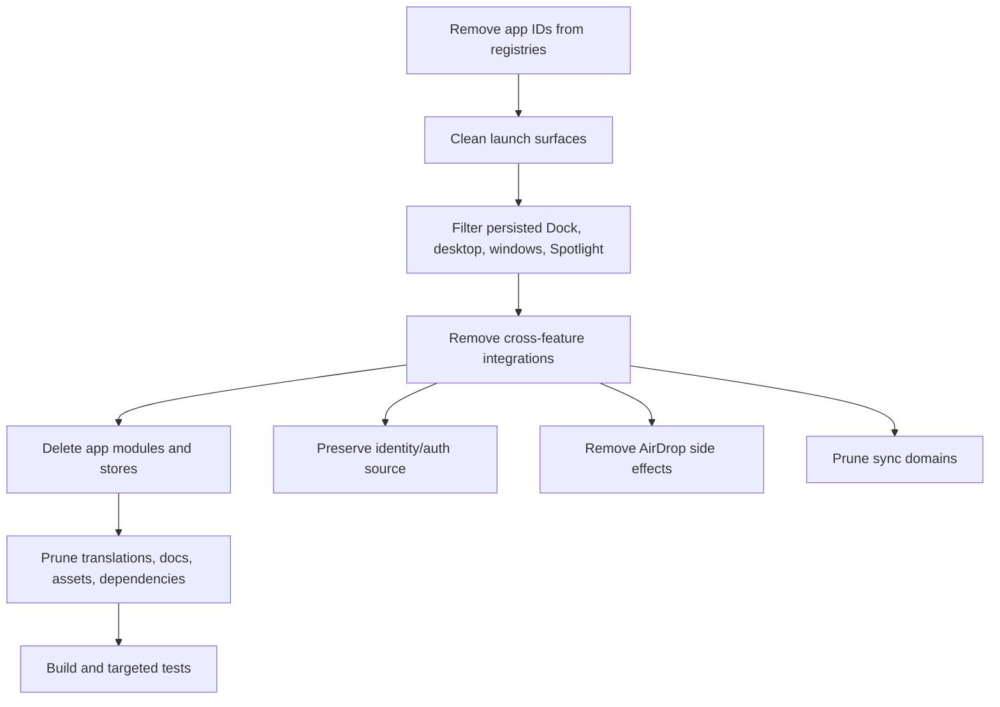

# refactor: Remove unused ryOS apps

## Summary

Remove the ticket-listed apps from the runnable ryOS product by unwiring app registration, launch surfaces, default shortcuts, sync/search integrations, and app-specific code. Preserve the shared identity/auth behavior currently provided through the Chats store unless implementation introduces a small replacement identity store.

---

## Problem Frame

PRSNL-148 asks to remove unused apps and clean remaining open-app references so the project can run. The current app model is registry-driven, but several removed apps are also referenced by Dock defaults, Finder virtual folders, Dashboard widgets, Spotlight, cloud sync, AI/chat tools, global listeners, and persisted stores.

---

## Requirements

- R1. Remove these app surfaces from the registry and user launch paths: Calendar, CandyBar, Chats, Contacts, Infinite Mac, iPod, Karaoke, Minesweeper, Soundboard, Synth, Terminal, Virtual PC, Winamp.
- R2. Remove AirDrop as a feature surface, including listener, Finder UI, store usage, and client/API references that keep it active.
- R3. Prevent stale persisted windows, desktop shortcuts, Dock pins, Spotlight results, and tool calls from opening removed apps.
- R4. Keep the remaining desktop shell runnable, including Finder, Internet Explorer, TextEdit, Paint, Photo Booth, Videos, Applet Store, Control Panels, Admin, Stickies, Slack, Dashboard if retained, and GitHub Contributions.
- R5. Preserve identity/auth-dependent behavior or replace its source cleanly before deleting shared Chats state.
- R6. Delete dead app modules, app-specific stores/hooks/utils/styles/assets, docs, translations, and dependencies only after imports and runtime references are removed.

---

## Scope Boundaries

- This plan does not redesign the desktop shell, app framework, window manager, or theme system.
- This plan does not migrate old user data for removed apps; inaccessible removed-app data is acceptable.
- This plan does not remove backend auth/rooms/messages APIs unless implementation proves they are no longer needed outside the removed Chats UI.
- This plan does not remove remaining apps just because they reference removed shared state; preserve or adapt those dependencies.

### Deferred to Follow-Up Work

- Replace Chats-derived identity with a dedicated owner/visitor identity store if that becomes larger than a narrow compatibility extraction.
- Remove backend chat/presence/auth APIs in a separate pass after confirming no remaining Applet Store, sync, admin, or shell behavior depends on them.
- Re-generate full app documentation after implementation if docs generation is still part of the project workflow.

---

## Context & Research

### Relevant Code and Patterns

- `src/config/appRegistry.tsx` is the authoritative full app registry, lazy component map, metadata import list, app window constraints, and `getNonFinderApps` source.
- `src/config/appRegistryData.ts` is the lightweight app ID/name source used by stores such as `useFilesStore` to generate app shortcuts without importing heavy components.
- `src/stores/useFilesStore.ts` creates app desktop aliases from `getAppBasicInfoList()` and needs removed apps excluded so stale shortcuts are not recreated.
- `src/stores/useDockStore.ts` currently pins `chats` and `karaoke` by default and must not reference removed app IDs.
- `src/App.tsx` mounts `AirDropListener`, `useBackgroundChatNotifications`, and `useAutoCloudSync`, all of which can keep removed features alive through side effects.
- `src/hooks/useSpotlightSearch.ts`, `src/workers/spotlightSearch.shared.ts`, and app event/launch helpers need removed app targets filtered or deleted to prevent launch attempts.
- `src/utils/cloudSyncShared.ts`, `src/utils/cloudSyncLaunch.ts`, `src/utils/syncLogicalDomains.ts`, `src/sync/domains.ts`, and `src/hooks/useAutoCloudSync.ts` include removed data domains for calendar, contacts, songs, and settings-backed iPod/Karaoke behavior.
- `src/apps/chats/tools/*` contains tool handlers that control Calendar, Contacts, Infinite Mac, iPod, and Karaoke; those cannot remain active if the target apps disappear.

### Institutional Learnings

- No directly matching `docs/solutions/` entry was found for removed app cleanup. Follow existing app framework docs and keep the diff deletion-first and registry-led.

### External References

- Not used. This is internal repo cleanup with established local patterns.

---

## Key Technical Decisions

- Registry-led removal: remove apps first from the app ID/name registries and full app registry, then chase compile errors and search results outward. This makes removed app IDs fail fast during implementation.
- Identity preservation: keep or extract the minimum identity/auth/session state currently provided by `useChatsStore`; do not delete it together with the Chats window if remaining features still need username or auth.
- AirDrop feature removal: treat AirDrop as cross-cutting feature cleanup rather than an app deletion because it is mounted globally and embedded in Finder.
- Sync-domain pruning: remove cloud sync domains only for removed product data, while preserving settings/files/videos/stickies/custom-wallpaper domains used by retained apps.
- Dependency cleanup last: remove packages such as `webamp`, `tone`, emulator/audio/game-related packages only after a final import scan proves no retained code imports them.

---

## Open Questions

### Resolved During Planning

- Should this remove app mentions only or remove actual apps? Resolve as actual app removal because the ticket says “remove unused app” and “remove remaining apps that are still open so I can run this project.”
- Can Chats be deleted directly? Resolve as no for shared state; remove the Chats app surface, but preserve or replace identity/auth state first.

### Deferred to Implementation

- Exact package removals: decide after imports are gone and `bun run build` identifies unused dependencies safely.
- Exact Dashboard behavior: implementation should either remove only Calendar/iPod widget types from Dashboard or remove Dashboard entirely only if the product owner expands scope.
- Exact stale persisted-window cleanup mechanism: implementation can filter removed IDs during app store hydration or launch resolution, whichever matches current store patterns best.

---

## High-Level Technical Design

> *This illustrates the intended approach and is directional guidance for review, not implementation specification. The implementing agent should treat it as context, not code to reproduce.*

---

## Implementation Units

### U1. Define Removed App Set and Unwire App Registries

**Goal:** Remove ticket-listed apps from all authoritative app lists so they are no longer launchable through normal app discovery.

**Requirements:** R1, R3, R4

**Dependencies:** None

**Files:**
- Modify: `src/config/appRegistryData.ts`
- Modify: `src/config/appRegistry.tsx`
- Modify: `src/types/appInitialData.ts`
- Test: no existing focused test file; build/typecheck is the primary coverage

**Approach:**
- Remove removed app IDs and names from the lightweight registry.
- Remove lazy component declarations, metadata imports, window configs, and registry entries for removed apps.
- Remove removed-app initial data types unless retained apps still consume them.
- Keep retained apps and shared helpers stable.

**Patterns to follow:**
- Existing split between lightweight `appRegistryData` and full `appRegistry`.
- Existing lazy-load pattern for retained apps.

**Test scenarios:**
- Integration: generating the app list returns only retained apps and never includes the removed IDs.
- Integration: `getAppComponent`, `getWindowConfig`, and icon lookup are never called by retained launch paths with removed IDs.
- Edge case: TypeScript should reject accidental references to removed app IDs after the `AppId` union is narrowed.

**Verification:**
- Removed IDs are absent from registry data and full registry.
- `bun run build` advances past registry/type errors for retained apps.

---

### U2. Clean Launch Surfaces, Dock Defaults, and Persisted App References

**Goal:** Prevent stale or generated launch points from reopening removed apps.

**Requirements:** R1, R3, R4

**Dependencies:** U1

**Files:**
- Modify: `src/stores/useDockStore.ts`
- Modify: `src/stores/useFilesStore.ts`
- Modify: `src/stores/useAppStore.ts`
- Modify: `src/hooks/useLaunchApp.ts`
- Modify: `src/components/layout/Dock.tsx`
- Modify: `src/components/layout/StartMenu.tsx`
- Modify: `src/components/layout/AppMenu.tsx`
- Modify: `src/components/layout/SpotlightSearch.tsx`
- Test: no existing focused test file; add one only if a nearby store test pattern exists during implementation

**Approach:**
- Remove removed app IDs from default Dock pins.
- Ensure generated `/Applications` and `/Desktop` app aliases follow the pruned lightweight registry.
- Filter or ignore persisted Dock/window entries whose app IDs no longer exist.
- Make launch helpers fail safely when given removed or unknown app IDs.

**Execution note:** Characterize current persisted-state handling before changing hydration logic if a focused store test pattern exists.

**Patterns to follow:**
- Existing protected Dock item handling in `useDockStore`.
- Existing app alias generation in `useFilesStore`.
- Existing app registry lookups used by launch/menu components.

**Test scenarios:**
- Happy path: a fresh session shows retained default Dock items only.
- Edge case: persisted Dock state containing `chats`, `karaoke`, or another removed ID is filtered or ignored without crashing.
- Edge case: persisted open window state for a removed app does not render a broken window.
- Integration: app menus and `/Applications` views list retained apps only.

**Verification:**
- Searching retained launch surfaces finds no removed app IDs except migration/filter constants if needed.
- App boot does not attempt dynamic imports for removed apps.

---

### U3. Remove AirDrop Feature Wiring

**Goal:** Remove AirDrop UI, listeners, state, and API/client references so it no longer runs in the background or appears in Finder.

**Requirements:** R2, R3, R4

**Dependencies:** U2

**Files:**
- Modify: `src/App.tsx`
- Modify: `src/apps/finder/components/FinderAppComponent.tsx`
- Modify: `src/apps/finder/hooks/useFinderLogic.ts`
- Modify: `src/apps/finder/hooks/useFileSystem.ts`
- Delete: `src/components/AirDropListener.tsx`
- Delete: `src/stores/useAirDropStore.ts`
- Delete: `src/apps/finder/components/AirDropView.tsx`
- Review/delete if present: API AirDrop handlers under `api/` or `src/api/`
- Test: no existing focused test file; build/typecheck is primary coverage

**Approach:**
- Remove global AirDrop listener mount.
- Remove Finder navigation/actions/view states that expose AirDrop.
- Remove AirDrop store and Pusher channel usage tied only to AirDrop.
- Remove AirDrop-related Downloads copy only if it exists solely for transfers; keep generic Downloads folder behavior.

**Patterns to follow:**
- Finder feature-view patterns in `FinderAppComponent` and `useFinderLogic`.
- Global side-effect mounting style in `App.tsx`.

**Test scenarios:**
- Happy path: Finder renders without an AirDrop sidebar/view option.
- Edge case: opening Finder with persisted navigation state pointing to AirDrop falls back to a valid Finder location.
- Integration: app boot no longer subscribes to AirDrop Pusher channels.

**Verification:**
- No active imports of `useAirDropStore` or `AirDropListener` remain.
- Build catches removed API or Finder references.

---

### U4. Preserve or Extract Identity/Auth State From Chats

**Goal:** Remove the Chats app UI without breaking retained features that depend on username/auth/session state.

**Requirements:** R1, R4, R5

**Dependencies:** U1

**Files:**
- Modify: `src/stores/useChatsStore.ts` or create a narrow identity store if needed
- Modify: `src/stores/helpers.ts`
- Modify: `src/hooks/useAuth.ts`
- Modify: `src/hooks/useGlobalPresence.ts`
- Modify: `src/hooks/useBackgroundChatNotifications.ts`
- Modify: retained consumers in Applet Store, Finder, Control Panels, Admin, Slack, or shared components as needed
- Test: existing auth/chat unit tests if still applicable, otherwise add focused store tests only if current test patterns support it

**Approach:**
- Keep the minimum state needed by retained consumers: username, auth flags, owner flag, session restore/logout if still required.
- Remove AI chat/message/room behavior from the retained identity surface unless a retained feature still uses it.
- Disable background chat notifications when the Chats app is removed.
- Avoid a broad auth API deletion in this ticket.

**Execution note:** Start by mapping current `useChatsStore` consumers and split only the minimum needed to keep retained behavior compiling.

**Patterns to follow:**
- Existing Zustand persisted-store style.
- Existing helper-selector pattern in `src/stores/helpers.ts`.

**Test scenarios:**
- Happy path: retained components that show username or owner state still render.
- Edge case: unauthenticated visitor state still has a safe username fallback.
- Error path: failed session restore does not crash retained app boot.
- Integration: removing Chats UI does not remove auth state needed by Applet Store or sync.

**Verification:**
- No retained code imports removed Chats UI/components.
- Remaining identity imports are intentionally named or documented as compatibility if `useChatsStore` remains.

---

### U5. Remove Removed-App Cross-Feature Integrations

**Goal:** Delete or adapt integrations that target removed app state from Dashboard, Spotlight, sync, chat tools, analytics, audio settings, shared URL handling, and generated docs.

**Requirements:** R1, R3, R4, R6

**Dependencies:** U1, U4

**Files:**
- Modify: `src/hooks/useSpotlightSearch.ts`
- Modify: `src/workers/spotlightSearch.shared.ts`
- Modify: `src/components/layout/dashboard/*`
- Modify: `src/stores/useDashboardStore.ts`
- Modify: `src/utils/cloudSyncShared.ts`
- Modify: `src/utils/cloudSyncLaunch.ts`
- Modify: `src/utils/syncLogicalDomains.ts`
- Modify: `src/sync/domains.ts`
- Modify: `src/hooks/useAutoCloudSync.ts`
- Modify: `src/utils/analytics.ts`
- Modify: `src/utils/i18n.ts`
- Modify/delete: `src/apps/chats/tools/*`
- Test: `tests/test-custom-wallpaper-processing.test.ts` only if sync/shared utilities touched indirectly; otherwise rely on build plus targeted unit tests if added

**Approach:**
- Remove Spotlight sources and launch actions for removed app data.
- Remove Dashboard widget types tied to Calendar/iPod/Karaoke, while keeping unrelated widgets if Dashboard remains.
- Remove calendar/contacts/song settings sync domains only when no retained feature consumes them.
- Remove chat tool handlers that control removed apps, and remove tool result display labels if they become dead.
- Remove analytics event constants for removed app actions when no retained code emits them.

**Patterns to follow:**
- Existing physical/logical cloud sync domain mapping.
- Existing Dashboard widget discriminated unions.
- Existing i18n app-id helper maps.

**Test scenarios:**
- Happy path: Spotlight returns retained app/file/video results without removed app sections.
- Edge case: cloud sync metadata from old removed domains is ignored or no longer requested without breaking retained sync domains.
- Integration: Dashboard renders retained widgets and no longer imports removed app stores.
- Integration: AI/tool code no longer advertises or executes controls for removed apps.

**Verification:**
- Build succeeds without imports from removed app stores.
- Search for removed app IDs in cross-feature code returns only intentional cleanup constants or docs.

---

### U6. Delete App Modules, Stores, Styles, Translations, Docs, and Assets

**Goal:** Remove dead code and content for deleted apps after all active references are gone.

**Requirements:** R1, R6

**Dependencies:** U1, U2, U3, U4, U5

**Files:**
- Delete: `src/apps/calendar`
- Delete: `src/apps/candybar`
- Delete: `src/apps/chats` UI/tool code after identity handling is preserved
- Delete: `src/apps/contacts`
- Delete: `src/apps/infinite-mac`
- Delete: `src/apps/ipod`
- Delete: `src/apps/karaoke`
- Delete: `src/apps/minesweeper`
- Delete: `src/apps/soundboard`
- Delete: `src/apps/synth`
- Delete: `src/apps/terminal`
- Delete: `src/apps/pc`
- Delete: `src/apps/winamp`
- Delete or prune: app-specific stores in `src/stores`
- Modify: `src/index.css`
- Modify: `src/styles/themes.css`
- Modify: `src/lib/locales/*/translation.json`
- Delete/update: `docs/2.1-chats.md`, `docs/2.3-ipod.md`, `docs/2.4-karaoke.md`, `docs/2.9-terminal.md`, `docs/2.11-soundboard.md`, `docs/2.12-synth.md`, `docs/2.14-minesweeper.md`, `docs/2.15-virtual-pc.md`, `docs/2.19-infinite-mac.md`, `docs/2.20-winamp.md`, `docs/2.21-calendar.md`, `docs/2.23-contacts.md`, `docs/2.24-candybar.md`
- Test: build/typecheck and repository search verification

**Approach:**
- Delete modules only after active imports are removed.
- Prune CSS selectors and translation keys tied only to removed apps.
- Remove generated average-color or thumbnail files tied to removed apps.
- Update documentation indexes if removed app docs are deleted.

**Patterns to follow:**
- Existing app module directory convention in `docs/3-application-framework.md`.
- Existing app documentation numbering if retained docs are updated rather than regenerated.

**Test scenarios:**
- Test expectation: none for deleted UI modules; build and import search are the appropriate verification.

**Verification:**
- No active source import points at deleted directories.
- Locale JSON remains valid for every supported language.
- Docs index no longer points to deleted app docs.

---

### U7. Prune Dependencies and Verify Build

**Goal:** Remove dependencies that are only used by deleted apps and prove the project still builds.

**Requirements:** R4, R6

**Dependencies:** U6

**Files:**
- Modify: `package.json`
- Modify: `bun.lock` or lockfile used by Bun if dependency removal changes it
- Test: package/build verification

**Approach:**
- Use import search and package usage checks before removing each dependency.
- Candidate dependencies to verify include `webamp`, `tone`, `wavesurfer.js`, emulator/game/audio packages, and app-specific media utilities.
- Keep dependencies used by retained apps, shared components, scripts, or tests even if they look related to removed apps.

**Patterns to follow:**
- Existing Bun package-management workflow in `AGENTS.md`.

**Test scenarios:**
- Happy path: `bun run build` completes after dependency pruning.
- Happy path: `bun run test:unit` completes or reports only unrelated pre-existing failures.
- Edge case: dependency removal does not break docs/scripts that still import the package.

**Verification:**
- `bun run build` passes.
- `bun run test:unit` passes or any unrelated pre-existing failure is documented.
- Final search for removed app IDs/names shows no active runtime references.

---

## System-Wide Impact

- **Interaction graph:** App registry, AppManager, Dock, Finder, Spotlight, Dashboard, sync, chat/tool infrastructure, and global listeners are all affected.
- **Error propagation:** Unknown removed app IDs should be ignored or filtered rather than throwing during boot.
- **State lifecycle risks:** Persisted Dock/window/file shortcut state may contain removed app IDs; hydration and launch paths must be defensive.
- **API surface parity:** Backend chat/auth APIs may remain for identity or retained features; do not remove API contracts unless all consumers are verified gone.
- **Integration coverage:** Build/typecheck is mandatory because app removal creates broad import/type fallout.
- **Unchanged invariants:** Retained apps should preserve their registry IDs, app launch behavior, desktop shell behavior, and user data stores.

---

## Risks & Dependencies

| Risk | Mitigation |
|------|------------|
| Removing `useChatsStore` breaks identity/auth consumers | Preserve or extract identity state before deleting Chats UI |
| Stale persisted app IDs crash boot | Filter unknown app IDs in Dock/window/shortcut/launch paths |
| Dashboard, Spotlight, or sync keeps importing removed stores | Treat cross-feature integrations as a dedicated unit before deleting modules |
| Dependency pruning removes packages still used by retained code | Remove packages only after import search and successful build |
| Locale JSON becomes invalid after key pruning | Validate via build and JSON parsing during normal TypeScript/Vite pipeline |

---

## Documentation / Operational Notes

- Update or delete removed app docs so generated docs and navigation do not advertise removed apps.
- Final report for implementation should list deleted app surfaces, preserved identity/auth decision, dependency removals, and verification gaps.
- If a PR is created, note that removed app user data is intentionally not migrated.

---

## Sources & References

- **Origin document:** `.context/attachments/[LINEAR]-PRSNL-148.md`
- Draft scope: `.context/plans/remove-unused-apps-from-ryos.md`
- App framework: `docs/3-application-framework.md`
- File-system app shortcut behavior: `docs/5-file-system.md`
- i18n app key patterns: `docs/7.2-i18n.md`
- App registries: `src/config/appRegistry.tsx`, `src/config/appRegistryData.ts`
